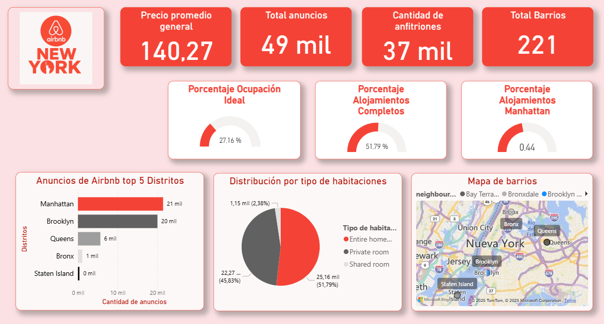

# 🌆 Análisis y Visualización de Airbnb NYC

Este proyecto tiene como objetivo analizar y visualizar datos de Airbnb en la ciudad de Nueva York, utilizando herramientas de procesamiento de datos en Python, almacenamiento en la nube con AWS S3, y visualización interactiva mediante Power BI.

---

## 🚀 Tecnologías utilizadas

- **Python** (`pandas`, `pyarrow`): limpieza y transformación de datos.
- **AWS S3**: almacenamiento de archivos Parquet accesibles desde URL pública.
- **Power BI**: visualización de datos, KPI, mapas y análisis interactivo.
- **Formato Parquet**: optimiza el rendimiento en la carga y consulta de datos.

---

## 📊 Dataset

El dataset fue extraído de Kaggle: [New York City Airbnb Open Data](https://www.kaggle.com/datasets/dgomonov/new-york-city-airbnb-open-data)

Incluye información detallada de anuncios publicados en Airbnb:

- ID de anuncio y anfitrión
- Localización geográfica
- Tipo de habitación
- Precio por noche
- Mínimo de noches requeridas
- Disponibilidad en el año (`availability_365`)
- Número de reseñas y más

---

## 📁 Proceso ETL

1. ✅ Carga del archivo original en formato CSV
2. ✅ Limpieza de filas incompletas o erróneas
3. ✅ Conversión de columnas a tipos numéricos válidos
4. ✅ Filtrado de precios sospechosos (`price < 10` o `price > 1000`)
5. ✅ Exportación a formato `.parquet` para optimizar carga
6. ✅ Subida del archivo limpio a un bucket público en AWS S3
7. ✅ Conexión directa desde Power BI a la URL de S3

---
## 🔍 Exploración de Datos (EDA)
Durante el análisis exploratorio, se realizaron los siguientes pasos clave:
 
 - Análisis de valores faltantes: se identificaron campos con nulos, como name y reviews_per_month, pero no afectaban el análisis principal.
 - Eliminación de duplicados: el dataset no contenía filas repetidas.
 - Detección de outliers: se filtraron precios fuera del rango razonable (<10 o >1000 USD).
 - Distribución por tipo de habitación: predominan las viviendas completas, seguidas de habitaciones privadas.
 - Mapa de calor: se observó mayor concentración de anuncios en Manhattan y Brooklyn.
 - Análisis de disponibilidad: se clasificaron los anuncios según su availability_365.

Cada gráfico fue acompañado de su interpretación dentro del notebook de EDA.

---

## 💡 Panel de visualización

### 🧮 Métricas clave:

- **Precio promedio general**
- **Total de anuncios**
- **Cantidad de anfitriones**
- **Total de barrios**
- **% Ocupación ideal** (availability > 200 días)
- **% Alojamiento tipo "entire home"**
- **% Anuncios en Manhattan**

### 📊 Gráficos:

- Top 5 distritos con más anuncios
- Distribución por tipo de habitación
- Mapa interactivo de barrios

### 📸 Captura del dashboard final:

---

## 🏗️ Arquitectura del pipeline

El siguiente pipeline resume el flujo completo:

1. 🧾 Carga de datos CSV desde Kaggle
2. 🧹 ETL en Python (`pandas`, `pyarrow`)
3. 📦 Exportación a Parquet
4. ☁️ Almacenamiento en **AWS S3** (público)
5. 📊 Visualización desde Power BI vía URL Parquet

---
## 🧾 Conclusiones

- Manhattan concentra la mayor cantidad de anuncios, especialmente de viviendas completas.

- La mayoría de los anuncios tienen buena disponibilidad (>200 días al año), lo que indica alta actividad de los anfitriones.

- El precio promedio se mantiene por debajo de 200 USD, con variabilidad según tipo de habitación y distrito.

- El formato Parquet y el uso de AWS S3 permitió optimizar la carga y mantener actualizado el dataset en Power BI sin necesidad de almacenar archivos localmente.

---

## 👤 Autor

**Octavio Alvarez**  

---

